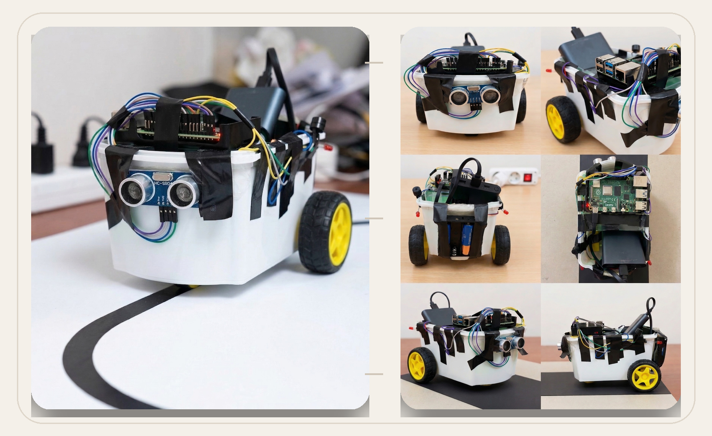
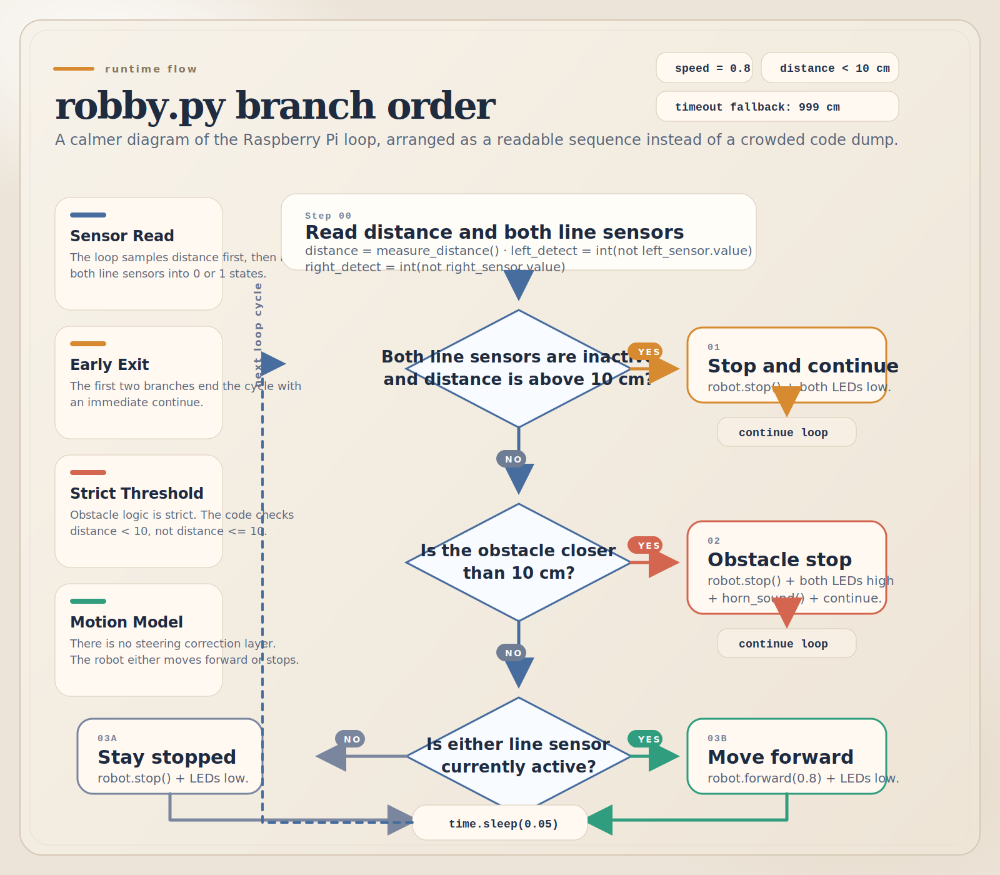

# Autonomous Line-Following Robot

<p align="center">
  
</p>

The real Raspberry Pi control script for a 2024 course project that follows a black line, stops when an obstacle is detected, and triggers LED and buzzer alerts. This repository is rebuilt around the on-device file exported from the project itself: [`robby.py`](robby.py).

## Project Snapshot

- Course: `YBS 2013 - Bilgisayar Donanımı`
- Original title: `Otonom Çizgi Takip ve Engel Algılama Robotu`
- Institution: `Dokuz Eylül Üniversitesi`
- Project year: `2024`
- Source of truth: Raspberry Pi project file `robby.py`
- Runtime stack: `Python`, `gpiozero`, `RPi.GPIO`, `Raspberry Pi 4`

## What The Script Actually Does

This README describes the code as it exists in [`robby.py`](robby.py), not an idealized version of the project.

- Measures distance with an `HC-SR04` ultrasonic sensor
- Uses two `LineSensor` inputs to detect the black guide line
- Drives the chassis forward at a fixed speed of `0.8`
- Stops the robot if the obstacle distance falls below `10 cm`
- Turns on two LEDs and plays a short buzzer pattern when an obstacle is detected
- Stops the robot when both line sensors lose the track

Important implementation detail:

- The current script does not apply left/right correction.
- If either line sensor is active, the robot moves forward.
- If both line sensors are inactive, the robot stops.
- The obstacle branch uses `distance < 10`, not `distance <= 10`.
- The `time.sleep(0.05)` delay runs only on the non-`continue` path at the end of the loop.

## Control Flow From The Real Script

<p align="center">
  
</p>

This flow mirrors the actual branch order in `motor_control()`:

1. Measure ultrasonic distance.
2. Read both line sensors.
3. Stop when both sensors lose the line and no close obstacle is present.
4. Stop and trigger both LEDs plus the buzzer only when `distance < 10`.
5. Otherwise, move forward if either line sensor still sees the track.
6. If neither sensor sees the track after those checks, stay stopped with both LEDs off.

## Hardware Used In The Script

- `Raspberry Pi 4`
- `HC-SR04` ultrasonic sensor
- `2x` line sensors
- `2x` LEDs
- `1x` buzzer
- `2x` DC motors
- motor driver chassis controlled through `gpiozero.Robot`

## Pin Map From robby.py

| Function | BCM pin |
| --- | ---: |
| Ultrasonic trigger | 23 |
| Ultrasonic echo | 24 |
| LED 1 | 16 |
| LED 2 | 25 |
| Buzzer | 22 |
| Left line sensor | 17 |
| Right line sensor | 27 |
| Left motor pins | 7, 8 |
| Right motor pins | 9, 10 |

## Run On Raspberry Pi

```bash
python3 -m venv .venv
source .venv/bin/activate
pip install -r requirements.txt
python3 robby.py
```

## Repository Contents

```text
.
|-- robby.py
|-- requirements.txt
|-- docs/assets/
|-- docs/report/original-course-report.docx
`-- docs/source-notes.md
```

## Included Documentation

- Original report: [`docs/report/original-course-report.docx`](docs/report/original-course-report.docx)
- Repository accuracy notes: [`docs/source-notes.md`](docs/source-notes.md)

## Validation

GitHub Actions runs a lightweight syntax check with `python -m py_compile robby.py` on every push and pull request.

That validation stays intentionally minimal because the script depends on Raspberry Pi hardware libraries and GPIO access at runtime.
